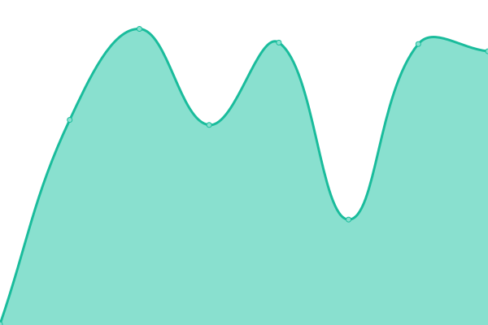

# [📈 Live Status](https://status.flylogs.com): <!--live status--> **🟩 All systems operational**

This repository contains the open-source uptime monitor and status page for [Iñigo In The Cloud](https://www.flylogs.com), powered by [Upptime](https://github.com/upptime/upptime).

With [Upptime](https://upptime.js.org), you can get your own unlimited and free uptime monitor and status page, powered entirely by a GitHub repository. We use [Issues](https://github.com/gestudio/status/issues) as incident reports, [Actions](https://github.com/gestudio/status/actions) as uptime monitors, and [Pages](https://status.flylogs.com) for the status page.

<!--start: status pages-->
<!-- This summary is generated by Upptime (https://github.com/upptime/upptime) -->
<!-- Do not edit this manually, your changes will be overwritten -->
<!-- prettier-ignore -->
| URL | Status | History | Response Time | Uptime |
| --- | ------ | ------- | ------------- | ------ |
|  [Flylogs](https://www.flylogs.com) | 🟩 Up | [flylogs.yml](https://github.com/gestudio/status/commits/HEAD/history/flylogs.yml) | 

 549ms
     
 | 

<a href="https://status.flylogs.com/history/flylogs">100.00%</a>
    

|  [Authentication Server](https://www.flylogs.com/users/login.json) | 🟩 Up | [authentication-server.yml](https://github.com/gestudio/status/commits/HEAD/history/authentication-server.yml) | 

 322ms
     
 | 

<a href="https://status.flylogs.com/history/authentication-server">100.00%</a>
    

|  [Flylogs Barcelona](https://bcn.flylogs.com) | 🟩 Up | [flylogs-barcelona.yml](https://github.com/gestudio/status/commits/HEAD/history/flylogs-barcelona.yml) | 

 568ms
     
 | 

<a href="https://status.flylogs.com/history/flylogs-barcelona">100.00%</a>
    

|  [Flylogs New York](https://us.flylogs.com) | 🟩 Up | [flylogs-new-york.yml](https://github.com/gestudio/status/commits/HEAD/history/flylogs-new-york.yml) | 

 187ms
     
 | 

<a href="https://status.flylogs.com/history/flylogs-new-york">100.00%</a>
    

|  [Flylogs Frankfurt](https://fra.flylogs.com) | 🟩 Up | [flylogs-frankfurt.yml](https://github.com/gestudio/status/commits/HEAD/history/flylogs-frankfurt.yml) | 

 498ms
     
 | 

<a href="https://status.flylogs.com/history/flylogs-frankfurt">100.00%</a>
    

<!--end: status pages-->

[**Visit our status website →**](https://status.flylogs.com)

## 📄 License

- Powered by: [Upptime](https://github.com/upptime/upptime)
- Code: [MIT](./LICENSE) © [Iñigo In The Cloud](https://www.flylogs.com)
- Data in the `./history` directory: [Open Database License](https://opendatacommons.org/licenses/odbl/1-0/)
